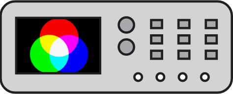

# ColorScope [](https://travis-ci.org/michalkielan/ColorScope) [](https://ci.appveyor.com/project/michalkielan/colorscope/branch/master) [](https://coveralls.io/github/michalkielan/ColorScope?branch=master)




Tool for analyze the image quality

## Requirements
* python-opencv
* matplotlib
* scikit-image

```
$ sudo pip install opencv-python matplotlib scikit-image
```

## Usage
Output format supported: `rgb`, `yuv`, `hsv`, `hls`

```
$ ./colorscope.py -i image.jpeg -out_fmt=rgb
R      G      B
23     24     232
255    255    255
...
```

Raw input images
```
$ ./colorscope.py -i image.yuv -pix_fmt=nv21 -s 640x480 -out_fmt=rgb
```

Measure and plot data
```
$ ./colorscope.py -i reference.jpeg -out_fmt=hls -o ref.json
$ ./colorscope.py -i capture.jpeg -out_fmt=hls -o cap.json
$ ./colorscope.py -gen ref.json cap.json
```

Compare of two images quality using PSNR and SSIM metric for multichannel  
```
$ ./colorscope.py -cp metrics reference_image_dir ref_pixel_format ref_video_size capture_image_dir cap_pixel_format cap_video_size
```
Currently all parameters must be explicitly stated. For defaults of pixel format and video size '' can be used.

Multichannel examples:
```
$ ./colorscope.py -cp ssim reference.jpg '' '' capture.jpg '' ''
$ ./colorscope.py -cp psnr reference.jpg '' '' capture.jpg '' ''
```

Compare of two images quality using PSNR and SSIM metric for single channel
```
$ ./colorscope.py -scp metrics channel_number reference_image_dir ref__pxl_format ref_video_size capture_image_dir cap_pxl_format cap_video_size
```

Single channel examples [default for BGR openCV format]
```
$ ./colorscope.py -scp 0 ssim reference.jpg '' '' capture.jpg '' ''
$ ./colorscope.py -scp 0 psnr reference.jpg '' '' capture.jpg '' ''
```
